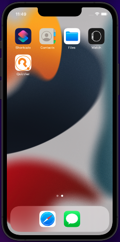
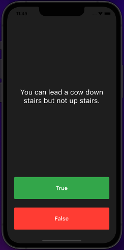
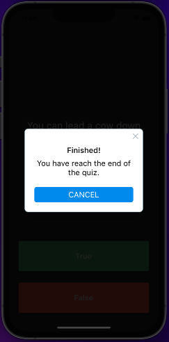
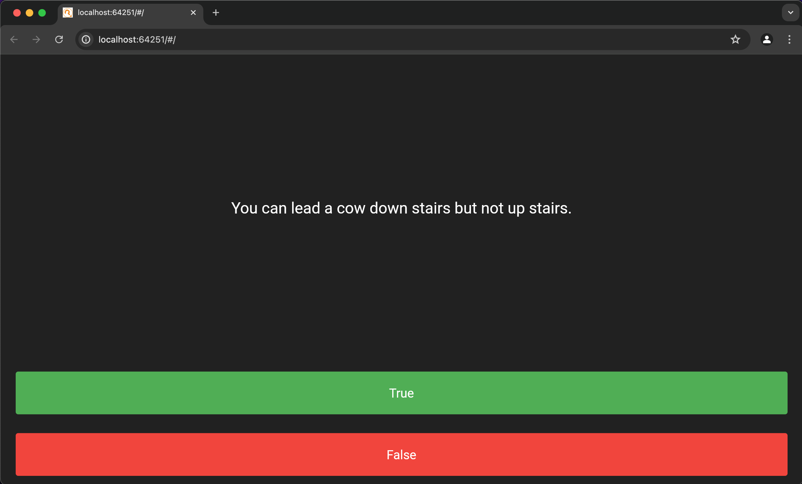
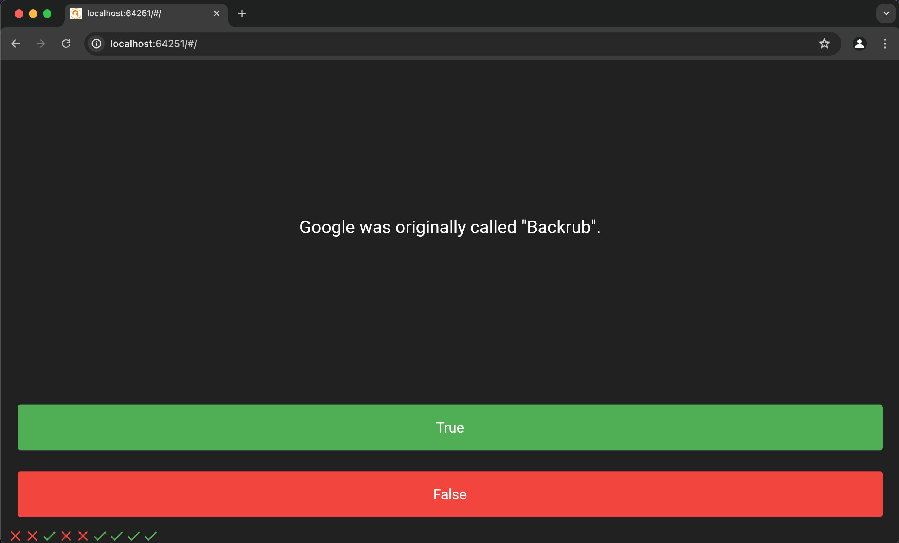
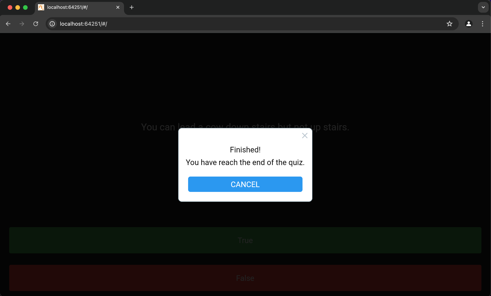

# quizzler

Today, I created an application and web application called Quizzler using the Dart language. Quizzler is a quiz game featuring True and False questions. Check out the attached pictures below. Have fun!

### Application

### Web Application

## What I Learned Today

- **Modularizing Code:** How to break down code into separate classes for better organization.
- **Dart Classes and Objects:** Understanding the basics of classes and objects in Dart.
- **Class Constructors:** Utilizing class constructors in Dart to initialize objects.
- **Widget Extraction:** Techniques for extracting widgets to refactor and clean up code.
- **Access Modifiers:** The difference between private and public modifiers in Dart.
- **Using Dart Lists:** How to effectively use lists in Dart.
- **Variable Declarations:** Understanding the differences between `var`, `const`, and `final` in Dart.
