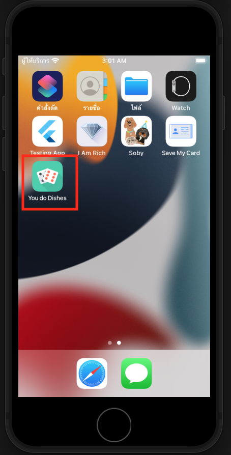
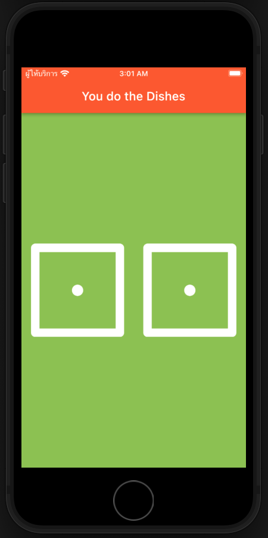
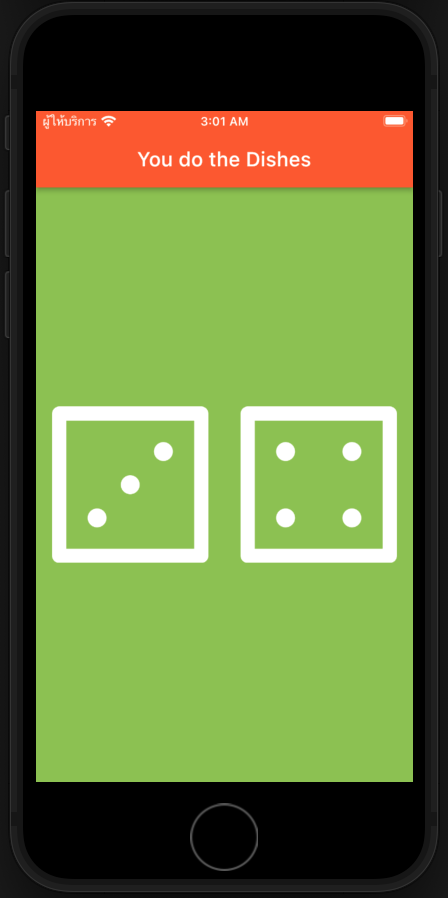

# who_will_do_the_dishes

### Inspiration
This application was inspired by my family. We often left the dishes unwashed, with no one wanting to clean them. To solve this, I created **You Do Dishes**, an app that uses a fun and fair method to decide who does the dishes.

### How It Works
In **You Do Dishes** application, two dice are rolled randomly. The person who gets the higher number wins, and the one with the lower number has to do the dishes. It's a simple and entertaining way to resolve the chore dispute!

### Screenshots
You can see the attached pictures for:
- The app icon
- The initial launch screen
- The results screen after pressing the button to determine the winner

___

## What I learned in this Project

1. Designing user interfaces with Flutter stateless widgets.
2. Updating user interfaces with Flutter stateful widgets.
3. Modifying properties of various widgets.
4. Detecting button presses using onPressed listeners.
5. Utilizing setState to mark the widget tree for updates on the next render.
6. Adapting widgets to screen dimensions with Expanded.
7. Understanding and applying string interpolation.
8. Learning basic Dart programming concepts, including data types and functions.
9. Implementing and using gesture controls in code.
