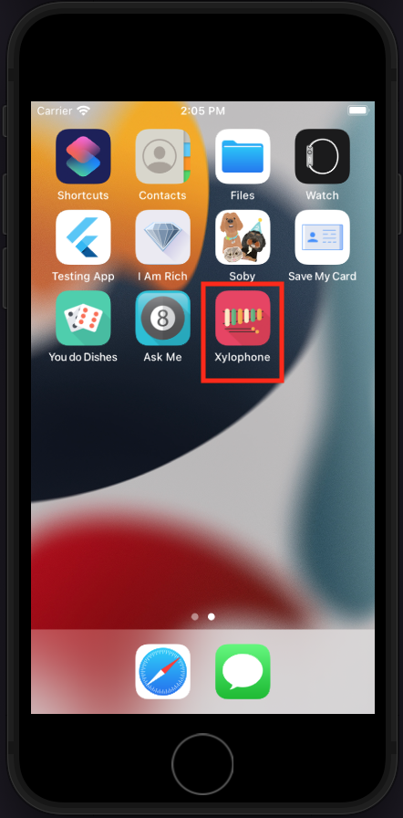
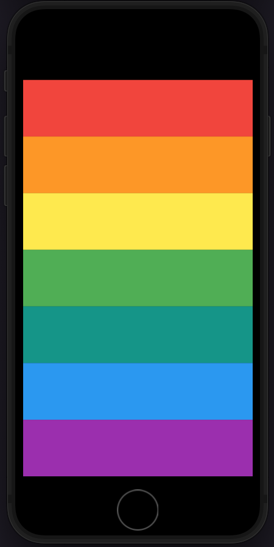

# Xylophone

Today, I created a xylophone application. It is a musical instrument on your phone, with bars tuned to specific pitches, allowing you to create your own sounds. Have fun!

[App Video](MDimages/video.mov)

## What I Learned in This Project

- Integrating open-source libraries into a project using Flutter packages.
- Implementing sound playback on both iOS and Android.
- Creating repeated user interface widgets.
- Utilizing Dart functions to handle input arguments and return outputs.
- Writing concise one-line functions with Dart's arrow syntax.

